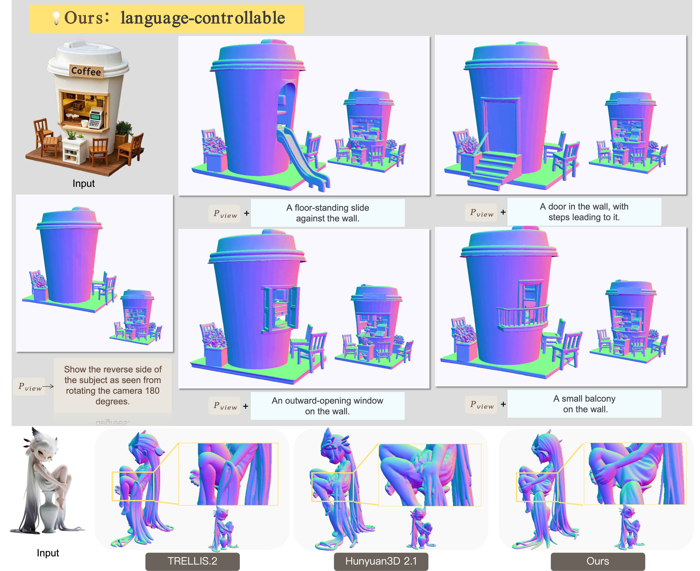

<h1 align="center" style="line-height:1.3; margin-bottom:0.6rem;">
  


  <span style="font-size:1.8rem; font-weight:600;">
    Prompting 3D Generation with Knowledge from Vision-Language Models
  </span>
</h1>


<h4 align="center" style="line-height:1.4; margin-top:0.6rem">
  <a href="https://github.com/xishuxishu/Know3D">Wenyue Chen</a><sup>1*</sup>,
  <a href="https://github.com/xishuxishu/Know3D">Wenjue Chen</a><sup>2*</sup>,
  <a href="https://penghtyx.github.io/yuki-lipeng/">Peng Li</a><sup>1*</sup>,
  <a href="https://qinghew.github.io">Qinghe Wang</a><sup>3</sup>,
  <a href="https://stephenjia.github.io">Xu Jia</a><sup>4</sup>,
  <a href="https://scholar.google.com/citations?user=VRgciTQAAAAJ&hl=en">Heliang Zheng</a><sup>4</sup>,
  <a href="https://github.com/xishuxishu/Know3D">Rongfei Jia</a><sup>2</sup>,
  <a href="https://liuyuan-pal.github.io/">Yuan Liu</a><sup>5</sup>,
  <a href="https://scholar.google.com/citations?user=CEEvb64AAAAJ&hl">Ronggang Wang</a><sup>6†</sup>
</h4>

<p align="center" style="margin:0.2rem 0 0.6rem 0;">
  <sup>1</sup> Peking University &nbsp;&nbsp;|&nbsp;&nbsp;
  <sup>2</sup> Math Magic &nbsp;&nbsp;|&nbsp;&nbsp;
  <sup>3</sup> The Hong Kong University of Science and Technology &nbsp;&nbsp;|&nbsp;&nbsp;
  <sup>4</sup> Dalian University of Technology &nbsp;&nbsp;|&nbsp;&nbsp;
</p>

<p align="center" style="font-size:0.95em; color:#666; margin-top:0;">
  * Equal contribution &nbsp;&nbsp;|&nbsp;&nbsp; † Corresponding author
</p>

<p align="center">
  <a href="https://xishuxishu.github.io/Know3D.github.io/">
    
  </a>
  <a href="https://arxiv.org/pdf/2603.22782">
      
  </a>
</p>


<h1 align="center" style="line-height:1.3; margin-bottom:0.6rem;">
  
</h1>

<!-- <p align="center">
    
</p> -->
</h4>

## Abstract
Recent advances in 3D generation have improved the fidelity and geometric details of synthesized 3D assets. However, due to the inherent ambiguity of single-view observations and the lack of robust global structural priors caused by limited 3D training data, the unseen regions generated by existing models are often stochastic and difficult to control, which may sometimes fail to align with user intentions or produce implausible geometries. In this paper, we propose Know3D, a novel framework that incorporates rich knowledge from multimodal large language models into 3D generative processes via latent hidden-state injection, enabling language-controllable generation of the back-view for 3D assets. We utilize a VLM-diffusion-based model, where the VLM is responsible for semantic understanding and guidance. The diffusion model acts as a bridge that transfers semantic knowledge from the VLM to the 3D generation model. In this way, we successfully bridge the gap between abstract textual instructions and the geometric reconstruction of unobserved regions, transforming the traditionally stochastic back-view hallucination into a semantically controllable process, demonstrating a promising direction for future 3D generation models.


## Citation
If you find our work helpful, please consider citing:
```bibtex
@article{chen2025know3d,
  title={Know3D: Prompting 3D Generation with Knowledge from Vision-Language Models},
  author={Wenyue Chen and Wenjue Chen and Peng Li and Qinghe Wang and Xu Jia and Heliang Zheng and Rongfei Jia and Yuan Liu and Ronggang Wang},
  year={2026},
  journal={arXiv preprint arXiv:2603.22782}
}
```
